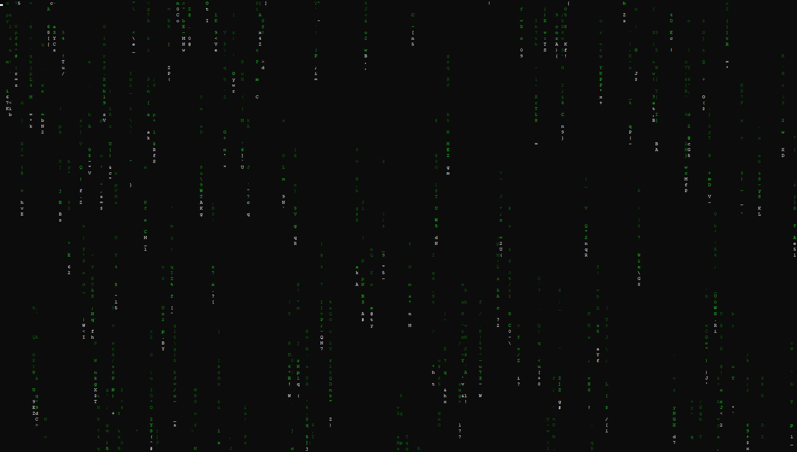

# Matrix Rain Terminal Simulation

This project is a simple, customizable "Matrix Rain" terminal simulation written in C++. It recreates the iconic visual effect of falling green characters, reminiscent of the movie *The Matrix*, directly in your command-line interface.



## Features

*   **Dynamic rain Generation:** The simulation creates streams of falling characters that flow smoothly down your terminal.
*   **Customizable Appearance:**
    *   **Rain Density:** Control the number of character rains with the `density` setting.
    *   **Rain Speed:** Adjust how quickly the characters fall using `base_speed` and `speed_var`.
    *   **Rain Length:** Configure the length of each rain stream using `max_rain_length` and `rain_length_var`.
    *   **Character Fade & Flicker:** Modify the fade rate (`fade`) and flicker intensity (`flicker`) for a dynamic visual effect.
    *   **Character Sets:** Choose from basic alphanumeric, Katakana characters, or a combination of both!
    *   **Color Palettes:** Customize the rain colors using ANSI escape codes for vibrant effects.
*   **Interactive Commands:** Modify the simulation parameters in real-time using a command-line interface.
*   **Responsive Resizing:** The simulation adapts to your terminal window's size.
*   **Optimized & Portable:** The implementation is optimized for performance and is designed to run on Unix-like systems (Linux, macOS). Uses Pthreads for enhanced performance.
*   **Toggle Help:** Press the `ESC` key to toggle the command list at any time.

## How to Run

1.  **Prerequisites:** Ensure you have a C++ compiler (g++, clang) installed on your system. You will also need `pthreads`.

2.  **Compilation:**

    ```bash
    g++ -o MatrixEffect MatrixEffect.cpp -pthread
    ```
    *   **`-pthread` is crucial:**  This links the pthreads library, which enables parallel processing for smoother animation.

3.  **Running:**

    ```bash
    ./MatrixEffect
    ```

4.  **Build with CMake**
    *   **Install CMake:** If you don't have CMake installed, download and install it from the official CMake website: \[https://cmake.org/download/].
    *   **Navigate to the Project Directory:** Open a terminal or command prompt and navigate to the directory containing your `CMakeLists.txt` file.
    *   **Create a Build Directory:** Create a separate directory for the build files (recommended):

        ```bash
        mkdir build
        cd build
        ```

    *   **Run CMake:** Run CMake to generate the build files for your system.

        ```bash
        cmake ..
        ```

    *   **Build the Project:**

        ```bash
        make
        ```

## How to Use the Program
*   **Toggle Help:** During execution press `ESC` to display the help.
*   **Enter Commands:** Type a command into the prompt (`>`) at the bottom of the terminal and press `Enter` to execute it.

## Available Commands

Once the simulation is running, you can enter commands directly into the prompt at the bottom of the terminal. Here's a list of available commands:

*   **`max_rains <int>`:** Set the maximum number of rains on the screen.
*   **`min_gap <int>`:** Set the minimum horizontal distance between rains.
*   **`frame_ms <int>`:** Set the delay between frames in milliseconds, controlling simulation speed.
*   **`density <double>`:** Set the rain density (percentage of screen occupied by rains).
*   **`base_speed <double>`:** Set the base falling speed of rains.
*   **`speed_var <double>`:** Set the variation in rain speed.
*   **`fade <double>`:** Set the rate at which characters in the rains fade.
*   **`flicker <double>`:** Set the flicker probability of characters in the rains.
*   **`bias <double>`:** Set the speed bias of the rains.
*   **`max_rain_length <int>`:** Set the maximum length of a rain.
*   **`rain_length_var <int>`:** Set the variation in the length of rains.
*   **`head_char_freq <double>`:** Set the probability of the head character being a basic alphanumeric character.
*   **`chars <string>`:** Set the character set ("basic", "katakana", or "both").
*   **`segment_config <char_set> <new_char_set>`:** Configure all segments with a given `char_set` appearance. Use `list` to see available character sets.  Example: `segment_config basic katakana`
*   **`rain_color <color_code> <new_color_code>`:** Configure all segments with a given color using ANSI color code. Use `list` to see available color codes. Example: `rain_color 255 40`
*   **`back`:** Exit the color or segment list and return to the animation.
*   **`resize`:** Resize the terminal to default 80x25 values

Press `ESC` to show this list of commands within the program.

## Customization Tips

*   Experiment with different values for `density`, `base_speed`, and `speed_var` to get the look you prefer.
*   Try low `fade` values and higher `flicker` for an interesting effect.
*   Use different color combinations for a unique feel.
*   If the code runs slow, consider increasing the `frame_ms`.
*   Try setting the `chars` to `katakana` to emulate The Matrix look.

## Contributing

Feel free to contribute to the project. If you find any bugs or have any ideas for new features, feel free to open an issue or submit a pull request.

## License

This project is licensed under the [MIT License](link-to-your-license).

## Credits

[Optional: Add credits for any resources or inspiration]
